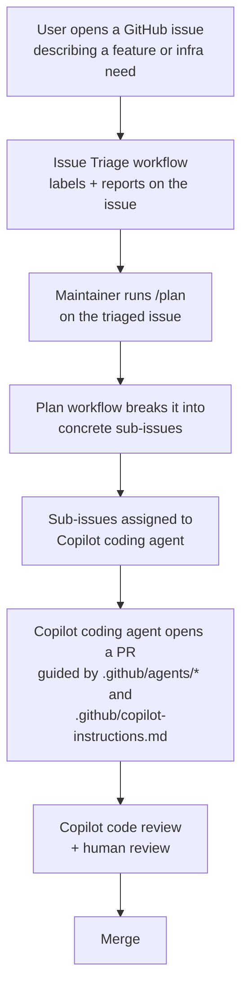

# Taskify — Agentic SDLC Demo

Taskify is a small Kanban board app (Node/Express API + React/Vite
frontend + Postgres). The app itself is secondary — this repo exists to
demonstrate an **agentic software development lifecycle (SDLC)**: how
GitHub Copilot and GitHub's agentic workflow tooling can take a request
from "an idea in an issue" all the way to a reviewed, merged pull request,
with humans staying in the loop at every consequential step.

## The end-to-end flow



1. **Requirements arrive as a GitHub issue.** Could be a feature request,
   bug, or — the case this demo highlights — an infrastructure/deployment
   need (e.g. "provision a Postgres flexible server for staging").
2. **Issue Triage** (`.github/workflows/issue-triage.md`, a
   [gh-aw](https://github.com/github/gh-aw) workflow from
   [githubnext/agentics](https://github.com/githubnext/agentics)) reads the
   issue, applies type/priority labels, flags infra asks with the
   `infra-request` label, checks for duplicates, and posts a triage report
   for maintainers.
3. **`/plan`** (`.github/workflows/plan.md`, also from agentics) is run by a
   maintainer on the triaged issue. It breaks the request into concrete,
   scoped sub-issues — this is the point where a vague "provision Azure
   infra" ask becomes a handful of well-defined tasks.
4. **Copilot coding agent** is assigned the sub-issues. For infrastructure
   work, it's guided by the custom agents in `.github/agents/`
   (`azure-iac-generator`, `terraform-azure-implement`,
   `terraform-iac-reviewer`) and by the repo-level memory in
   `.github/copilot-instructions.md` — so it knows this repo uses Terraform
   only, where each Terraform module lives, and that it must never run
   `terraform apply`/`destroy` without explicit confirmation.
5. **Copilot coding agent opens a PR.** GitHub's built-in **Copilot code
   review** is automatically requested (see
   `.github/COPILOT_CODE_REVIEW.md` for the one-time repo setting), plus a
   human reviewer. Terraform PRs additionally get a pass from the
   `terraform-iac-reviewer` agent.
6. **Merge.** The loop is fully auditable: every step left an issue,
   comment, label, or PR review behind.

## Worked example: an infrastructure request

> **Issue title:** Provision Postgres + Container Apps for the `dev` environment
>
> **Body:** "We need somewhere to actually run Taskify's api/web containers
> and a real Postgres instance for the `dev` environment, in
> subscription `b6f10878-9f8a-4b3f-8bc5-3464cdd79c77`. Should match the
> module layout already scaffolded in `/infrastructure/terraform`."

Walking it through the flow:

1. Issue Triage reads it, applies `feature` + `infra-request` labels, and
   reports: *"Coding agent suitability: needs maintainer judgment — spans
   multiple Terraform modules and an environment decision."*
2. A maintainer runs `/plan` on the issue. It comes back with sub-issues
   like:
   - *"Author `modules/foundation`: resource group + networking for dev"*
   - *"Author `modules/data`: Postgres Flexible Server for dev"*
   - *"Author `modules/containers` + `modules/application`: Container Apps
     environment and the api/web apps for dev"*
   - *"Wire `environments/dev/main.tf` to call the above modules"*
3. Each sub-issue is assigned to Copilot coding agent. Before writing any
   `.tf`, the agent (per `terraform-azure-implement`) creates
   `infrastructure/.terraform-planning-files/INFRA.dev-foundation.md` (etc.)
   capturing goal/module/environment/constraints, then authors the
   Terraform, runs `terraform fmt`/`validate` (never `apply`), and opens a
   PR with the plan output attached for review.
4. Copilot code review + `terraform-iac-reviewer` + a human reviewer check
   the PR against the checklist in
   `.github/agents/terraform-iac-reviewer.md` (state locking, least
   privilege, no hardcoded secrets, correct module placement, etc.).
5. Once approved, it merges. **No `terraform apply` runs automatically —**
   applying is a deliberate, separate, human-approved action outside the
   scope of this demo.

## Repository layout

```
apps/api/                  Node.js + Express REST API (Postgres via `pg`)
apps/web/                   React + Vite + TypeScript + Tailwind frontend
sql/                         Postgres schema + seed data
docker-compose.yml             Local dev stack
infrastructure/                 Terraform IaC — scaffold only, see infrastructure/README.md
.github/agents/                   Custom Copilot agents for IaC work
.github/workflows/                 gh-aw agentic workflows (issue-triage, plan)
.github/copilot-instructions.md      Repo-level Copilot memory
.github/COPILOT_CODE_REVIEW.md         How to enable automatic Copilot code review
```

## Running the app locally

```bash
docker compose up --build
```

- Frontend: http://localhost:5173
- API: http://localhost:3000/api/health
- Postgres seeds automatically from `sql/` on first boot.

## What's intentionally *not* done here

- **No Terraform resources are provisioned.** `/infrastructure/terraform`
  is scaffolding (folders, provider/version pins, module READMEs) — real
  authoring happens live via the agentic workflow described above, not as a
  bulk upfront generation step.
- **No live Azure deployment.** Nothing in this repo's CI or agents runs
  `terraform apply`/`destroy` or any deploying `az` command without
  explicit human confirmation in the moment.
- **No custom review workflow for code review** — that's GitHub's built-in
  Copilot code review, configured as a repo setting
  (`.github/COPILOT_CODE_REVIEW.md`), not a bespoke `gh-aw` workflow.
